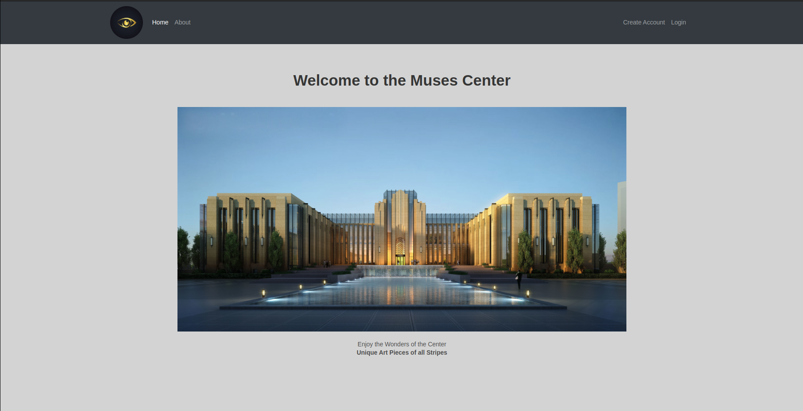
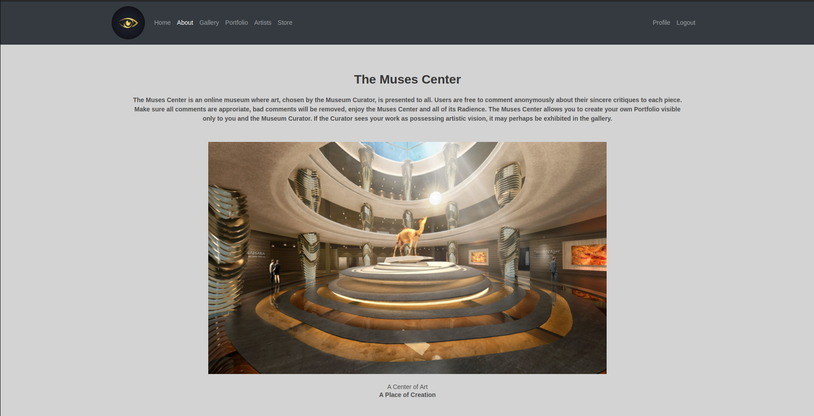
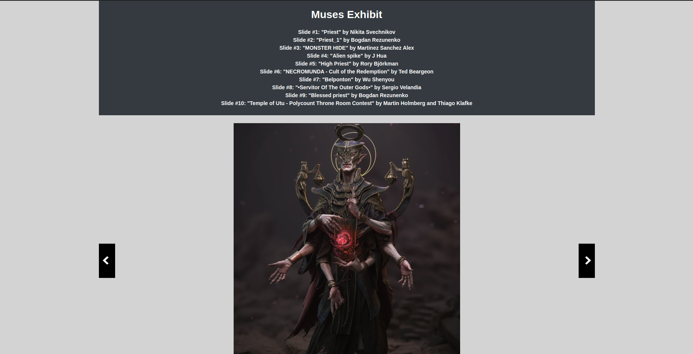

# muses-center
This is the frontend of the Muses Center App, the backend is located here: https://github.com/RolandYambao/muses-api

## Purpose:
The Muses Center is a MERN application showcasing an online museum where artists can post their artwork to be curated by the site administrator. The best works will be shown in a gallery where anonymous comments can critique the work.

## Technologies:
This MERN Application, as stated in its name, utilizes MongoDB (as the database), Express (for routes), React (as the framework), and Node.js. Other technologies include Axios and bycrypt used for fetching the API and authentication respectively.

## Development Approach:
The Muses Center was designed for specific features manifesting in their respective page. The Gallery Showcased the curated art with creatable anonymous comments, the portfolio showcases the CRUD functionality of portfolio pieces associated with each use, and the store simply has clickable buttons with props. All of this is wrapped around a particular sharp and simple aesthetic that mimics the serenity of a museum.

## Installation:
Firstly, fork and clone this repository and type "npm install" in the terminal upon opening this project, this will install all necessary dependencies to ensure its functionality. Create an .env file containing "REACT_APP_SERVER_URL=" after the equals sign, place the link for the localhost where the backend is running.

## Code Snippets:
1. App.js - The Hub to connect all Components
~~~js
// Imports
import React, { useEffect, useState, Component } from 'react';
import { Route, Switch, Redirect } from 'react-router-dom';
import jwt_decode from 'jwt-decode';
// import * as jwt_decode from 'jwt-decode';
import setAuthToken from './utils/setAuthToken';

// CSS
import './App.css';

// Components
import Signup from './components/Signup';
import About from './components/About';
import Footer from './components/Footer';
import Login from './components/Login';
import Navbar from './components/Navbar';
import Profile from './components/Profile';
import Welcome from './components/Welcome';
import Gallery from './components/Gallery';
import Portfolio from './components/Portfolio';
import AllUsers from './components/AllUsers';
import Store from './components/Store';

const PrivateRoute = ({ component: Component, ...rest }) => {
  let token = localStorage.getItem('jwtToken');
  // console.log('===> Hitting a Private Route');
  return <Route {...rest} render={(props) => {
    return token ? <Component {...rest} {...props} /> : <Redirect to="/login" />
  }} />
}

function App() {
  // Set state values
  const [currentUser, setCurrentUser] = useState('');
  const [isAuthenticated, setIsAuthenticated] = useState(true);

  useEffect(() => {
    let token;

    if (!localStorage.getItem('jwtToken')) {
      setIsAuthenticated(false);
      // console.log('====> Authenticated is now FALSE');
    } else {
      token = jwt_decode(localStorage.getItem('jwtToken'));
      setAuthToken(localStorage.getItem('jwtToken'));
      setCurrentUser(token);
    }
  }, []);

  const nowCurrentUser = (userData) => {
    // console.log('===> nowCurrentUser is here.');
    setCurrentUser(userData);
    setIsAuthenticated(true);
  }

  const handleLogout = () => {
    if (localStorage.getItem('jwtToken')) {
      // remove token for localStorage
      localStorage.removeItem('jwtToken');
      setCurrentUser(null);
      setIsAuthenticated(false);
    }
  }

  return (
    

      <Navbar handleLogout={handleLogout} isAuth={isAuthenticated} />
      

        <Switch>
          <Route path='/signup' component={Signup} />
          <Route
            path="/login"
            render={(props) => <Login {...props} nowCurrentUser={nowCurrentUser} setIsAuthenticated={setIsAuthenticated} user={currentUser} />}
          />
          <PrivateRoute path="/gallery" component={Gallery} user={currentUser} handleLogout={handleLogout} />
          <PrivateRoute path="/portfolio" component={Portfolio} user={currentUser} handleLogout={handleLogout} />
          <PrivateRoute path="/store" component={Store} user={currentUser} handleLogout={handleLogout} />
          <PrivateRoute path="/artists" component={AllUsers} user={currentUser} handleLogout={handleLogout} />
          <PrivateRoute path="/profile" component={Profile} user={currentUser} handleLogout={handleLogout} />
          <Route exact path="/" component={Welcome} />
          <Route path="/about" component={About} />
        </Switch>
      

      <Footer />
    

  );
}

export default App;

~~~

2. Gallery.js - The page showcasing the curated art pieces
~~~js
import './Gallery.css';

import React, { Component } from 'react';
import axios from "axios";
import Comment from "./Comment";
import jwt_decode from 'jwt-decode';
import setAuthToken from '../utils/setAuthToken';
const { REACT_APP_SERVER_URL } = process.env;

class Gallery extends Component {
    constructor(props) {
        super(props);
        this.state = {
            data: [],
        };
    }

    handleComment(e) {
        e.preventDefault();
        this.setState({
            content: e.target.value,
        })
    }

    handleSubmit = (e) => {
        e.preventDefault();

        const commentData = {
            content: this.state.content,
        }

        axios.post(`${REACT_APP_SERVER_URL}/comments`, commentData)
            .then(response => {
                window.location.reload();
            })
            .catch(error => {
                alert('No Comment Posted');
            });
    };

    componentDidMount() {
        axios.get(`${REACT_APP_SERVER_URL}/comments`)
            .then((response) => {
                this.setState({
                    data: response.data
                });
            })
            .catch((error) => {
                console.log('ERROR', error)
            });
    }

    displayComments() {
        const displayComments = this.state.data.map((a, idx) => {
            return (
                <Comment key={idx} content={a.content} />
            )
        });
        return displayComments;
    }

    render() {
        return (
            

                

                    <ul>
                        <section className="hero bg-dark is-small">
                            

                                

                                    
Muses Exhibit

                                    
Slide #1: "Priest" by Nikita Svechnikov

                                    
Slide #2: "Priest_1" by Bogdan Rezunenko

                                    
Slide #3: "MONSTER HIDE" by Martinez Sanchez Alex

                                    
Slide #4: "Alien spike" by J Hua

                                    
Slide #5: "High Priest" by Rory Björkman

                                    
Slide #6: "NECROMUNDA - Cult of the Redemption" by Ted Beargeon

                                    
Slide #7: "Belponton" by Wu Shenyou

                                    
Slide #8: "•Servitor Of The Outer Gods•" by Sergio Velandia

                                    
Slide #9: "Blessed priest" by Bogdan Rezunenko

                                    
Slide #10: "Temple of Utu - Polycount Throne Room Contest" by Martin Holmberg and Thiago Klafke

                                

                            

                        </section>
                         
                        <li id="no-js-slider-1" class="slide">
                            
                            <a class="prev" href="#no-js-slider-10">prev</a>
                            <a class="next" href="#no-js-slider-2">next</a>
                        </li>
                        <li id="no-js-slider-2" class="slide">
                            
                            <a class="prev" href="#no-js-slider-1">prev</a>
                            <a class="next" href="#no-js-slider-3">next</a>
                        </li>
                        <li id="no-js-slider-3" class="slide">
                            
                            <a class="prev" href="#no-js-slider-2">prev</a>
                            <a class="next" href="#no-js-slider-4">next</a>
                        </li>
                        <li id="no-js-slider-4" class="slide">
                            
                            <a class="prev" href="#no-js-slider-3">prev</a>
                            <a class="next" href="#no-js-slider-5">next</a>
                        </li>
                        <li id="no-js-slider-5" class="slide">
                            
                            <a class="prev" href="#no-js-slider-4">prev</a>
                            <a class="next" href="#no-js-slider-6">next</a>
                        </li>
                        <li id="no-js-slider-6" class="slide">
                            
                            <a class="prev" href="#no-js-slider-5">prev</a>
                            <a class="next" href="#no-js-slider-7">next</a>
                        </li>
                        <li id="no-js-slider-7" class="slide">
                            
                            <a class="prev" href="#no-js-slider-6">prev</a>
                            <a class="next" href="#no-js-slider-8">next</a>
                        </li>
                        <li id="no-js-slider-8" class="slide">
                            
                            <a class="prev" href="#no-js-slider-7">prev</a>
                            <a class="next" href="#no-js-slider-9">next</a>
                        </li>
                        <li id="no-js-slider-9" class="slide">
                            
                            <a class="prev" href="#no-js-slider-8">prev</a>
                            <a class="next" href="#no-js-slider-10">next</a>
                        </li>
                        <li id="no-js-slider-10" class="slide">
                            
                            <a class="prev" href="#no-js-slider-9">prev</a>
                            <a class="next" href="#no-js-slider-1">next</a>
                        </li>
                    </ul>
                

                                
                <form id="commentSection" onSubmit={this.handleSubmit.bind(this)}>
                    <input type="text" name="content" value={this.state.content} onChange={this.handleComment.bind(this)} placeholder="Your Anonymous Critique Here" id="commentBox" />
                    <button type="submit" id="comment">Submit</button>
                </form>
                 
                {this.displayComments()}
                    
            

        );
    }
}

export default Gallery;
~~~

3. Portfolio.js - Where the Portfolio Pieces of an Individual User is shown
~~~js
import './Portfolio.css';

import React, { Component } from 'react';
import axios from "axios";
import PortfolioPiece from "./PortfolioPiece";
import CreatePortfolio from "./CreatePortfolio";
import EditPortfolio from "./EditPortfolio";
import DeletePortfolio from "./DeletePortfolio";
import jwt_decode from 'jwt-decode';
import setAuthToken from '../utils/setAuthToken';
const { REACT_APP_SERVER_URL } = process.env;

class Portfolio extends Component {

    constructor(props) {
        super(props);
        this.state = {
            users: [],
        };
    }

    componentDidMount() {
        let token = localStorage.getItem('jwtToken')  //grabs token 
        setAuthToken(token); //function to auth saved token (seprate JS file)
        axios.get(`${REACT_APP_SERVER_URL}/users/my-portfolio`,
            {
                header: { 'Access-Control-Allow-Origin': '*' }
            })
            .then((response) => {
                this.setState({
                    users: response.data.user.portfolio
                });
            })
            .catch((error) => {
                console.log('ERROR', error)
            });
    }

    displayPortfolio() {
        const displayPortfolio = this.state.users.map((a, idx) => {
            return (
                <PortfolioPiece key={idx} pictureUrl={a.pictureUrl}
                    title={a.title} description={a.description} />
            )
        });
        return displayPortfolio;
    }

    render() {
        return (
            

                <section className="hero bg-dark is-small">
                    

                        

                            
Your Personal Art Portfolio

                            
The Museum Curator would Decide if your Work may be Exhibited

                        

                    

                </section >
                

                    
<CreatePortfolio />

                    
<EditPortfolio />

                    
<DeletePortfolio />

                

                

                    

                        

                            {this.displayPortfolio()}
                        

                    

                

            

        );
    }
}

export default Portfolio;
~~~

4. CreatePortfolio.js - The Component for creating Portoflio Pieces
~~~js
import './Portfolio.css';

import React, { Component } from 'react';
import axios from "axios";
import jwt_decode from 'jwt-decode';
import setAuthToken from '../utils/setAuthToken';
const { REACT_APP_SERVER_URL } = process.env;

class CreatePortfolio extends Component {
    constructor(props) {
        super(props);
        this.state = {
            redirect: true,
        };
    }

    handlePicture(e) {
        e.preventDefault();
        this.setState({
            pictureUrl: e.target.value,
        })
    }

    handleTitle(e) {
        e.preventDefault();
        this.setState({
            title: e.target.value,
        })
    }

    handleDescription(e) {
        e.preventDefault();
        this.setState({
            description: e.target.value,
        })
    }

    handleSubmit = (e) => {
        e.preventDefault();
        const portfolioData = {
            pictureUrl: this.state.pictureUrl,
            title: this.state.title,
            description: this.state.description,
        }

        axios.post(`${REACT_APP_SERVER_URL}/users/new-portfolio`, portfolioData)
            .then(response => {
                const { token } = response.data;
                // save token to localStorage
                localStorage.setItem('jwtToken', token);
                // set token to headers
                setAuthToken(token);
                // decode token to get the user data
                const decoded = jwt_decode(token);
                // set the current user
                this.props.nowCurrentUser(decoded); // funnction passed down as props.
            })
            .catch(error => {
                alert('No Portfolio Piece Posted');
            });
        window.location.reload();
    };

    render() {
        return (
            

                

                    <figure className="avatar">
                        
                    </figure>
                    <form id="portfolioInputSection" onSubmit={this.handleSubmit.bind(this)}>
                        

                            

                                <input type="text" name="picture" value={this.state.pictureUrl} onChange={this.handlePicture.bind(this)} placeholder="URL" id="portfolioInputBoxAdd" />
                            

                        

                        

                            

                                <input type="text" name="title" value={this.state.title} onChange={this.handleTitle.bind(this)} placeholder="Title" id="portfolioInputBoxAdd" />
                            

                        

                        

                            

                                <input type="text" name="decription" value={this.state.description} onChange={this.handleDescription.bind(this)} placeholder="Description" id="portfolioInputBoxAdd" />
                            

                        

                        <button
                            type="submit" className="button is-block is-primary is-medium" id="portfolioInput" onClick="window.location.reload(false)">
                            Add Portfolio Piece
                        </button>
                    </form>
                

            

        );
    }
}

export default CreatePortfolio;
~~~

## Screenshot:

## Wireframes:

## Reflections:
I am proud of this project, for its simple yet beautiful appearance. The concept of the site is also quite utilitarian and unique, it is akin to an art portfolio website focused solely on competitiveness on making the best work.

## License
Distributed under the MIT License. See `LICENSE.md` for more information.

